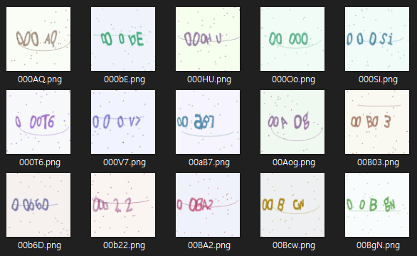
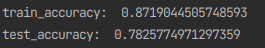
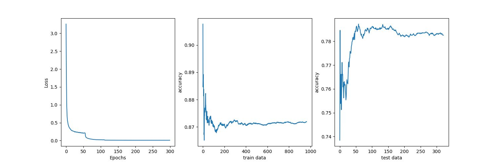

# CAPTCHA-classification with CRNN
CAPTCHA classification with CRNN(CNN+RNN)<br/>
<br/><br/>
Dataloader code: captcha_dataset.py<br/>
Model code: Network.py<br/>
Train, Test code: main.py<br/>
<br/>

## Application technology
```
Python  
CNN(Convolutional Neural Network)
RNN(Recurrent Neural Network)  
Pytorch  
```
<br/>

## Dataset 
https://www.kaggle.com/datasets/akashguna/large-captcha-dataset
<br/>
 

<br/>

## Instructions
1. Unzip the zip file and put it in the pycharm project directory<br/>
2. Adjust the channel tensor of the network according to the image size<br/>
3. The original image data is 256 x 256 and the image data used in the project is 128 x 128.
4. If you want to change original image data to 128 x 128 image file, use image_convert.py file

<br/>

## Result

 
train accuracy and test accuracy

<br/>
<br/>

 
loss and accuracy(train,test)
